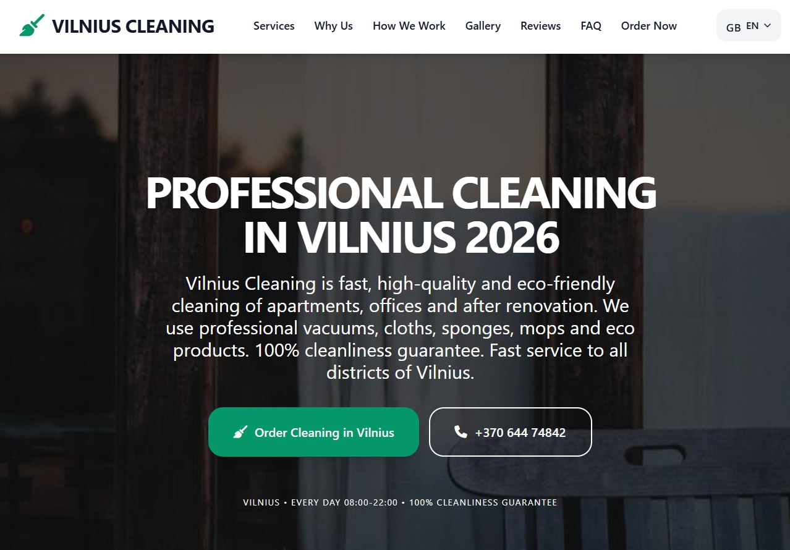

# 🧹 Vilnius Cleaning 2026 v2.0 — Premium Multilingual Professional Cleaning Website

**Fully ready premium landing page for 2026** for a professional cleaning company in Vilnius (Lithuania).  
5 languages • Maximum SEO 2026 • Powerful price calculator with 30% discount • Beautiful design • Professional HTML emails • Smart traffic logger.

**🌐 Live Demo:** [meistru.lt](https://meistru.lt/)  
**🧮 Price Calculator:** [kalkuliatorius.php](https://meistru.lt/kalkuliatorius.php)  
**💰 Support the author:** [donate.php](https://meistru.lt/donate.php)

---
### 📸 Screenshots

**Main page (English version):**

**Order form + mobile version:**

---
### ✨ Key Features of the Project (v2.0 — updated February 28, 2026)

- **5 fully localized language versions** (all files are separate, fully translated and optimized):
  - 🇱🇹 Lithuanian — [`index.php`](https://meistru.lt/)
  - 🇬🇧 English — [`en.php`](https://meistru.lt/en.php)
  - 🇺🇦 Ukrainian — [`ua.php`](https://meistru.lt/ua.php)
  - 🇷🇺 Russian — [`ru.php`](https://meistru.lt/ru.php)
  - 🇳🇴 Norwegian — [`no.php`](https://meistru.lt/no.php)

- **New powerful files in v2.0**:
  - `kalkuliatorius.php` — modern price calculator with real-time calculation, automatic 30% discount, 10-minute countdown timer (localStorage + cookie), validation and beautiful HTML email
  - `traffic_logger.php` — smart logger that detects country, city, traffic source (Google, TikTok, Facebook, Instagram, YouTube), device and IP caching
  - `sitemap.xml` — fully updated dynamic sitemap with priorities and dates
  - `robots.txt` — optimized for a multilingual multi-page website
  - `.htaccess` — improved 404 handling, lang/success parameters and folder protection
  - `404.php` — stylish 404 page with automatic redirect timer to homepage (8 seconds)
  - `donate.php` — separate author support page (Buy Me a Coffee, Wise, PayPal, Vipps + QR code)
  - `about.html` — full project documentation with tabs for all languages
  - `ifile.php` — convenient file manager (bonus for administration)

- **100% cleaning theme** — professional photos (apartments, offices, post-renovation, vacuums, cloths, mops, eco-products, clean interiors)
- **Maximum SEO 2026**:
  - Extended meta tags + keywords + LSI
  - Open Graph + Twitter Cards
  - Schema.org LocalBusiness + JSON-LD
  - Canonical, robots, theme-color
  - Long SEO texts over 400 words in every language version
  - Optimized H1–H3 headings

- **Beautiful order form** with validation, CSRF protection and automatic redirect
- **Modern HTML email** to inbox (gradient, data table, buttons, logo) — sent to 3 addresses
- **Stylish 404 page** with auto-redirect timer
- **Automatic 404 handling** via `.htaccess`

---
### 📱 Design & UX (Tailwind CSS + smooth animations)
- Full-screen Hero section
- “Before & After” gallery
- Benefits block with icons
- 4-step work process
- Customer reviews
- FAQ (accordion)
- Contact bar (phone + WhatsApp + Viber + Telegram)
- Mobile menu + language dropdown with flags

---
### 📧 Form & Email
- `submit.php` — reliable handler with beautiful HTML email
- Automatic redirect to the same language version
- Protection from empty fields + CSRF

---
### 🛠 Technical Stack (v2.0)
- PHP 8+
- Tailwind CSS (CDN)
- Font Awesome 6
- Google Fonts (Inter + Playfair Display)
- Schema.org JSON-LD
- traffic_logger.php + sitemap.xml + robots.txt + .htaccess
- ifile.php (file manager)

---
### 🚀 How to Launch (2 minutes)
1. Upload all files to the site root (`public_html` or `www`)
2. Set your 3 email addresses in `submit.php`
3. Upload `.htaccess`, `robots.txt` and `sitemap.xml`
4. Check folder permissions (755/644)
5. Open **[Live Demo](https://meistru.lt/)** — the site is ready!

---
### 📁 Full File Structure (v2.0)

**Author:** [Ruslan Bilohash](https://bilohash.com)  
**GitHub:** [github.com/Ruslan-Bilohash](https://github.com/Ruslan-Bilohash)

❤️ **SPONSORSHIP — Support the author**  
If the template helped you — you can support the author:

- [☕ Buy Me a Coffee](https://buymeacoffee.com/bilohash)
- [💸 Wise](https://wise.com/pay/me/ruslanb933)
- [💳 PayPal](https://www.paypal.com/donate/?hosted_button_id=GSS6YYMXZ3J4N)
- [🇳🇴 Vipps](https://vipps.no) → +47 462 55 885

**Separate support page:** [/donate.php](https://meistru.lt/donate.php)

Every support is motivation to create even better templates ❤️

**Ready for commercial use right now!**  
Open **[meistru.lt](https://meistru.lt/)** and start receiving cleaning orders today.
