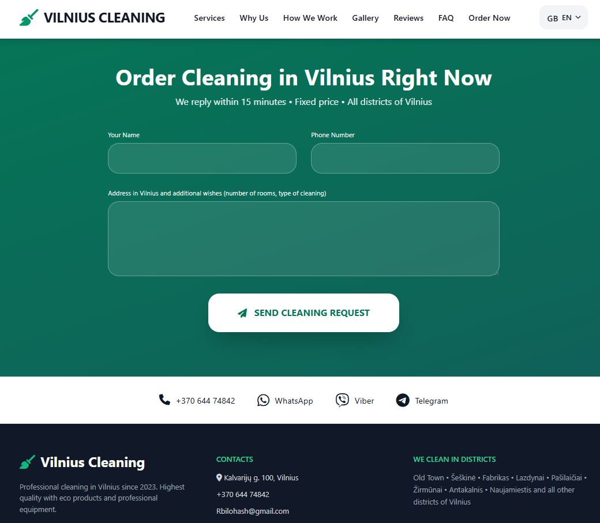

# 🧹 Vilnius Cleaning 2026 v2.0 — Premium flerspråklig profesjonell renholdsside

**Fullstendig ferdig premium landingsside for 2026** for et profesjonelt renholdsfirma i Vilnius (Litauen).  
5 språk • Maksimal SEO 2026 • Kraftig priskalkulator med 30% rabatt • Vakkert design • Profesjonelle HTML-e-poster • Smart trafikklogger.

**🌐 Live Demo:** [meistru.lt](https://meistru.lt/)  
**🧮 Priskalkulator:** [kalkuliatorius.php](https://meistru.lt/kalkuliatorius.php)  
**💰 Støtt forfatteren:** [donate.php](https://meistru.lt/donate.php)

---
### ✨ Hovedfordeler med prosjektet (v2.0 — oppdatert 28. februar 2026)

- **5 fullverdige språkversjoner** (alle filer er separate, fullt oversatt og optimalisert):
  - 🇱🇹 Litauisk — [`index.php`](https://meistru.lt/)
  - 🇬🇧 Engelsk — [`en.php`](https://meistru.lt/en.php)
  - 🇺🇦 Ukrainsk — [`ua.php`](https://meistru.lt/ua.php)
  - 🇷🇺 Russisk — [`ru.php`](https://meistru.lt/ru.php)
  - 🇳🇴 Norsk — [`no.php`](https://meistru.lt/no.php)

- **Nye kraftige filer i v2.0**:
  - `kalkuliatorius.php` — moderne priskalkulator med sanntidsberegning, automatisk 30% rabatt, 10-minutters nedtelling (localStorage + cookie), validering og vakkert HTML-e-post
  - `traffic_logger.php` — smart logger som oppdager land, by, trafikkilde (Google, TikTok, Facebook, Instagram, YouTube), enhet og IP-caching
  - `sitemap.xml` — fullstendig oppdatert dynamisk sitemap med prioriteringer og datoer
  - `robots.txt` — optimalisert for flerspråklig flerside-nettsted
  - `.htaccess` — forbedret 404-håndtering, lang/success-parametere og mappebeskyttelse
  - `404.php` — stilig 404-side med automatisk nedtelling til forsiden (8 sekunder)
  - `donate.php` — egen støtteside for forfatteren (Buy Me a Coffee, Wise, PayPal, Vipps + QR-kode)
  - `about.html` — full prosjektdokumentasjon med faner for alle språk
  - `ifile.php` — praktisk filbehandler (bonus for administrasjon)

- **100% renholdstema** — profesjonelle bilder (leiligheter, kontorer, etter renovering, støvsugere, kluter, mopper, eco-produkter, rene interiører)
- **Maksimal SEO 2026**:
  - Utvidet meta-tags + keywords + LSI
  - Open Graph + Twitter Cards
  - Schema.org LocalBusiness + JSON-LD
  - Canonical, robots, theme-color
  - Lange SEO-tekster på over 400 ord på hver språkversjon
  - Optimaliserte overskrifter H1–H3

- **Vakkert bestillingsskjema** med validering, CSRF-beskyttelse og automatisk omdirigering
- **Moderne HTML-e-post** til postkasse (gradient, datatabell, knapper, logo) — sendes til 3 adresser
- **Stilig 404-side** med autotimer for omdirigering
- **Automatisk 404-håndtering** via `.htaccess`

---
### 📸 Skjermbilder

**Hovedsiden (engelsk versjon):**

**Bestillingsskjema + mobilversjon:**

---
### 📱 Design og UX (Tailwind CSS + jevne animasjoner)
- Hero-seksjon fullskjerm
- «Før og Etter» galleri
- Fordelsblokk med ikoner
- 4-trinns arbeidsprosess
- Kundeanmeldelser
- FAQ (trekkspill)
- Kontaktlinje (telefon + WhatsApp + Viber + Telegram)
- Mobilmeny + språkdropdown med flagg

---
### 📧 Skjema og e-post
- `submit.php` — pålitelig behandler med vakkert HTML-e-post
- Automatisk omdirigering til samme språkversjon
- Beskyttelse mot tomme felt + CSRF

---
### 🛠 Teknisk stack (v2.0)
- PHP 8+
- Tailwind CSS (CDN)
- Font Awesome 6
- Google Fonts (Inter + Playfair Display)
- Schema.org JSON-LD
- traffic_logger.php + sitemap.xml + robots.txt + .htaccess
- ifile.php (filbehandler)

---
### 🚀 Slik starter du (2 minutter)
1. Last opp alle filer til rotmappen på nettstedet (`public_html` eller `www`)
2. Sett opp 3 e-postadresser i `submit.php`
3. Last opp `.htaccess`, `robots.txt` og `sitemap.xml`
4. Sjekk mappetillatelser (755/644)
5. Åpne **[Live Demo](https://meistru.lt/)** — nettstedet er klart!

---
### 📁 Full filstruktur (v2.0)
---
**Forfatter:** [Ruslan Bilohash](https://bilohash.com)  
**GitHub:** [github.com/Ruslan-Bilohash](https://github.com/Ruslan-Bilohash)

❤️ **SPONSORSTØTTE — Støtt forfatteren**  
Hvis malen hjalp deg — kan du støtte:

- [☕ Buy Me a Coffee](https://buymeacoffee.com/bilohash)
- [💸 Wise](https://wise.com/pay/me/ruslanb933)
- [💳 PayPal](https://www.paypal.com/donate/?hosted_button_id=GSS6YYMXZ3J4N)
- [🇳🇴 Vipps](https://vipps.no) → +47 462 55 885

**Separat støtteside:** [/donate.php](https://meistru.lt/donate.php)

Hver støtte er motivasjon til å lage enda bedre maler ❤️

**Klar for kommersiell bruk med en gang!**  
Åpne **[meistru.lt](https://meistru.lt/)** og begynn å motta bestillinger på rengjøring i dag.
