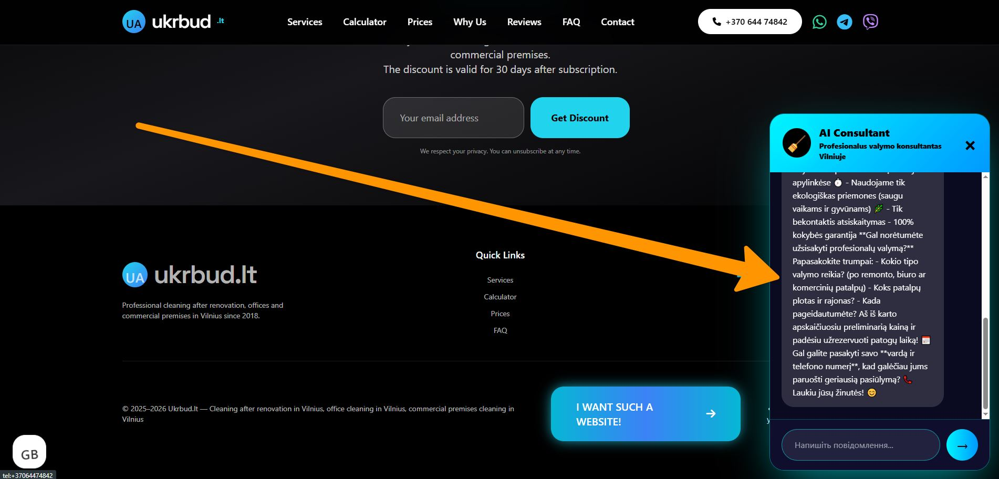

## 🤖 AI Consultant — Розумний чат-бот на базі Grok xAI

Інтелектуальний AI-помічник, вбудований безпосередньо на сайт **Ukrbud.lt**.  
Бот автоматично відкривається через 4 секунди після завантаження сторінки і **першим** починає розмову, допомагаючи клієнту швидко оформити замовлення на прибирання.

### Основні можливості бота

- **Автоматичне відкриття** — з’являється самостійно через 4 секунди
- **Говорить першим** — вітає клієнта та відразу пропонує допомогу
- **Підтримка 5 мов** — Lithuanian, Russian, Ukrainian, English, Norwegian (автоматично визначає мову клієнта)
- **Активна допомога** — допомагає розрахувати вартість, уточнити деталі (площа, район, тип прибирання) та зібрати контактні дані
- **Інтеграція з Telegram** — усі повідомлення клієнта та відповіді бота надходять адміністратору в реальному часі
- **Збереження історії** — кожна розмова зберігається для подальшого аналізу
- **Мобільна адаптивність** — повністю адаптований під смартфони (на мобільних займає весь екран)

### Як працює бот

1. Клієнт заходить на сайт → через 4 секунди з’являється вікно чату
2. Бот першим вітає клієнта та пропонує допомогу
3. Клієнт пише запит (наприклад: «Хочу уборку после ремонта 80 м²»)
4. Бот уточнює деталі, розраховує приблизну вартість і просить ім’я + телефон
5. Усі повідомлення дублюються адміністратору в Telegram

### Приклад першого повідомлення (литовською):

> Sveiki! 🧹 Aš esu AI konsultantas iš Ukrbud.lt.  
> Ar norėtumėte užsisakyti profesionalų valymą po remonto, biuro ar komercinių patalpų?  
> Greitas išvykimas per 60 min, ekologiškos priemonės ir geriausios kainos Vilniuje.  
> Papasakokite, kokio valymo jums reikia — aš iš karto apskaičiuosiu kainą ir padėsiu забронювати! ✨

### Технічна реалізація

- Бекенд: PHP + cURL (запити до Grok xAI API)
- Фронтенд: Чистий JavaScript (`chat.js`)
- Збереження історії: JSON-файли в папці `/ai/conversations/`
- Захист: rate limiting (25 запитів за 5 хвилин на сесію)
- Логування: усі розмови зберігаються в лог-файлах

Бот значно підвищує конверсію сайту, допомагаючи клієнтам швидко отримати консультацію та оформити замовлення 24/7.

---

Готовий до використання на всіх мовних версіях сайту (`index.php`, `ru.php`, `ua.php`, `en.php`).
