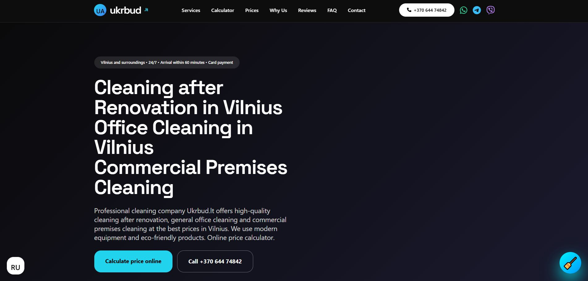
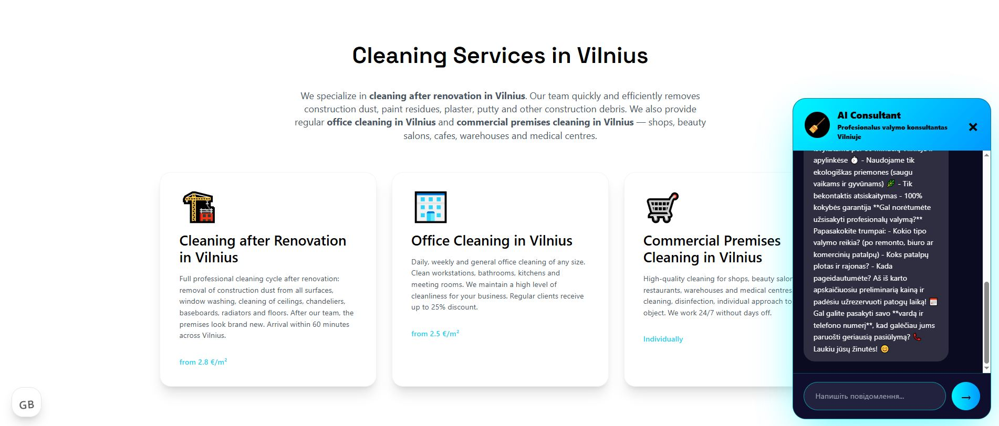
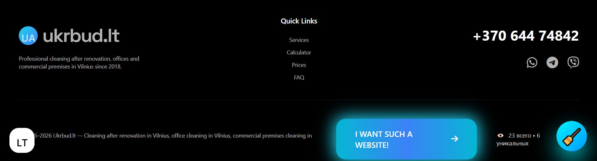

# Ukrbud.lt — Профессиональная уборка в Вильнюсе

Современный многоязычный сайт клининговой компании **Ukrbud.lt**, специализирующейся на профессиональной уборке после ремонта, уборке офисов и коммерческих помещений в Вильнюсе и окрестностях.

## ✨ Главные возможности сайта

- **Полная многоязычность** — 5 языков: Литовский, Русский, Украинский, Английский и Норвежский
- **Интерактивный онлайн-калькулятор** стоимости уборки (после ремонта, офисов, коммерческих помещений)
- **Умный AI Consultant** на базе Grok xAI — чат-бот, который первым начинает разговор и помогает оформить заказ
- **GDPR-согласный баннер** с возможностью отказаться и принять cookies снова
- **Красивые автоматические письма** подтверждения заказа и подписки на скидку 30%
- **Блок партнёров** со ссылками на проверенные компании
- **Расширенная SEO-оптимизация** с правильными hreflang-тегами, Schema.org и микроразметкой
- **Современный адаптивный дизайн** с плавными анимациями и высокой конверсией

### GDPR Баннер согласия

Современный и удобный баннер согласия на использование файлов cookie, полностью соответствующий требованиям GDPR.

**Особенности баннера:**
- Автоматическое определение языка пользователя
- Две кнопки: **«Погоджуюсь»** и **«Відхилити»**
- При отказе появляется мягкое предупреждение сверху страницы (не блокирует сайт)
- Кнопка **«Прийняти cookie знову»** в сообщении об отказе
- Выбор пользователя сохраняется в `localStorage`
- Полностью адаптивный и доступный дизайн

**Поддерживаемые языки баннера:**
- Литовский (LT)
- Русский (RU)
- Украинский (UK)
- Английский (EN)
- Норвежский (NO)

### AI Consultant (Grok xAI)

Интеллектуальный чат-бот, встроенный в сайт:

- Автоматически открывается через 4 секунды после загрузки страницы
- Первым начинает разговор приветственным сообщением
- Поддерживает все языки сайта
- Помогает клиенту рассчитать стоимость, уточнить детали и оформить заказ
- Отправляет все переписки администратору в Telegram
- Сохраняет историю разговоров для каждого пользователя

### Блок «Наши партнёры»

На сайте представлены надёжные партнёры:
- **Baltic Clean** — профессиональный клининг
- **Meistru.lt** — ремонтные услуги
- **Bilohash.com** — веб-разработка и цифровые решения

### Технические особенности

- Один файл `gdpr-consent.php` обслуживает все языковые версии
- Полная поддержка `hreflang` и `canonical` для корректной индексации
- Расширенная Schema.org разметка (LocalBusiness + Service + FAQPage)
- Автоматические красивые HTML-письма с подтверждением заказа и скидкой 30%
- Защита от спама и CSRF-атак
- Полностью адаптивный дизайн (мобильные устройства + десктоп)

## Поддерживаемые языки

| Язык          | Код | Файл          |
|---------------|-----|---------------|
| Литовский     | lt  | `index.php`   |
| Русский       | ru  | `ru.php`      |
| Украинский    | uk  | `ua.php`      |
| Английский    | en  | `en.php`      |
| Норвежский    | no  | (поддержка добавлена) |

---

### Как работает GDPR-баннер

1. При первом посещении появляется баннер внизу экрана.
2. Пользователь может выбрать **«Погоджуюсь»** или **«Відхилити»**.
3. При отказе появляется мягкое жёлтое предупреждение сверху страницы с объяснением и кнопкой **«Прийняти cookie знову»**.
4. Выбор пользователя сохраняется в браузере.

Баннер полностью соответствует требованиям GDPR и обеспечивает баланс между удобством пользователя и юридической корректностью.

---

**Демо сайта:** [https://ukrbud.lt](https://ukrbud.lt)

---
